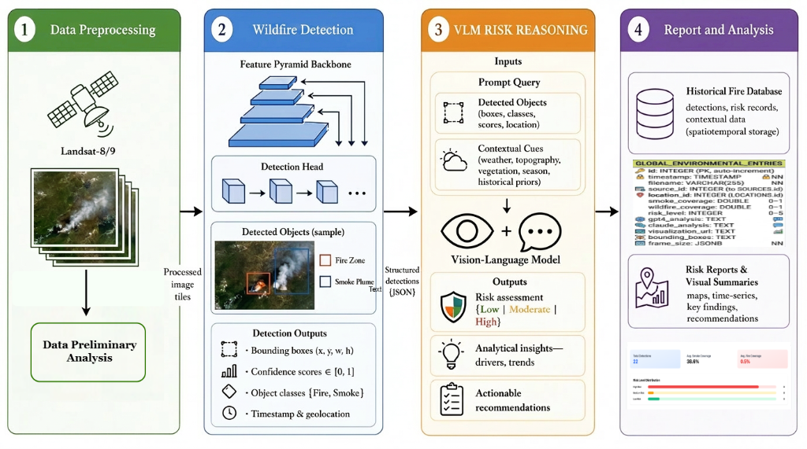
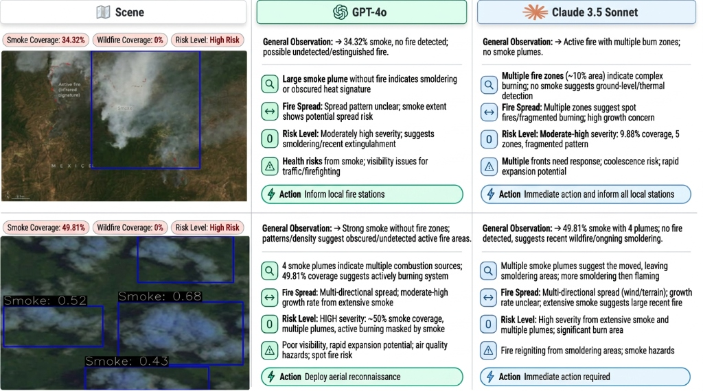

<div align="center">

# WildfireVLM: AI-powered Analysis for Early Wildfire Detection and Risk Assessment Using Satellite Imagery

[](IGARSS2026_WildfireVLM.pdf) [](https://github.com/Ayanzadeh93/_WildfireVLM_) [](https://github.com/Ayanzadeh93/_WildfireVLM_) [](https://github.com/Ayanzadeh93/_WildfireVLM_)

<br>



<br>



*Official system architecture (top) and qualitative risk reasoning comparison between GPT-4o and Claude 3.5 Sonnet (bottom).*

---

[**Overview**](#overview) | [**Architecture**](#architecture) | [**Dataset**](#dataset) | [**Results**](#results) | [**Citation**](#citation)

</div>

## 🌟 Overview

Wildfires pose an escalating threat to global ecosystems. Early detection is critical, but traditional satellite monitoring often struggles with faint smoke signals and complex weather conditions. **WildfireVLM** introduces a revolutionary approach:

- **SOTA Detection**: Leverages **YOLOv12** to identify fire zones and smoke plumes in multi-spectral satellite imagery with high precision.
- **Contextual Reasoning**: Integrates **MLLMs** (GPT-4o, Claude 3.5 Sonnet) to transform raw detections into actionable risk assessments and response recommendations.
- **Multi-Source Integration**: Harmonizes data from **Landsat-8/9** and **GOES-16** for comprehensive spatial and temporal coverage.

## 🏗️ Architecture

WildfireVLM is built on a modular service-oriented architecture designed for scalability and real-time processing.

1. **Input Module**: Processes Landsat-8/9 and GOES-16 imagery via specialized preprocessing pipelines.
2. **Detection Core**: Employs **YOLOv12** to localize fire and smoke features.
3. **VLM Risk Reasoning**: Utilizes MLLMs to analyze detections alongside contextual cues (topography, weather) to generate structured risk reports.
4. **Reporting**: Stores results in a historical database and generates interactive visual dashboards.

## 📊 Dataset: Wildfire-Smoke-RS

We introduce a meticulously curated dataset for wildfire detection in remote sensing imagery:

- **Sources**: Landsat-8/9 (15-30m resolution), GOES-16 (2km resolution, 5-min refresh).
- **Size**: 3,771 high-quality labeled images.
- **Classes**: `Fire Zone`, `Smoke Plume`.
- **Format**: 416x416 pixel patches, multispectral-aligned.

## 📈 Performance

WildfireVLM sets a new benchmark for wildfire detection accuracy using the YOLOv12 backbone.

| Model              | mAP (%)  | Precision (%) | Recall (%) | F1-score (%) |
| :----------------- | :------: | :-----------: | :--------: | :----------: |
| YOLOv8             |   72.1   |     60.7      |    67.6    |     64.0     |
| YOLOv11            | **84.1** |     51.7      |  **89.8**  |     65.6     |
| YOLO-NAS           |   54.1   |     56.0      |    57.1    |     56.6     |
| **YOLOv12 (Ours)** |   74.7   |   **81.1**    |    74.8    |   **77.8**   |

*Note: YOLOv12 is selected as the primary detection core due to its superior balance of precision and F1-score, minimizing false positives critical for disaster management.*

## 🧠 MLLM Integration (LLM-as-Judge)

We evaluate the quality of risk reasoning using an **LLM-as-judge** framework with a shared rubric.

| Model             | Reasoning Score (1-10) |
| :---------------- | :--------------------: |
| **GPT-4o**        |        **7.03**        |
| Claude 3.5 Sonnet |          6.16          |

GPT-4o demonstrates higher semantic accuracy and greater actionable clarity in generating prioritized response recommendations.

## 🚀 Getting Started

### Prerequisites

- Python 3.9+
- PyTorch 2.0+
- OpenAI / Anthropic API Keys (for VLM reasoning)

### Installation

```bash
git clone https://github.com/Ayanzadeh93/_WildfireVLM_.git
cd _WildfireVLM_
pip install -r requirements.txt
```

### Quick Run

```python
from wildfire_vlm import WildfireAnalyzer

analyzer = WildfireAnalyzer(model="yolov12", vlm="gpt-4o")
report = analyzer.process_scene("path/to/landsat_image.tif")
print(report.summary)
```

## 📜 Citation

If you find this work useful in your research, please cite:

```bibtex
@inproceedings{ayanzadeh2026wildfirevlm,
  title={WildfireVLM: AI-powered Analysis for Early Wildfire Detection and Risk Assessment Using Satellite Imagery},
  author={Ayanzadeh, Aydin and Dixit, Prakhar and Kamal, Sadia and Halem, Milton},
  booktitle={IEEE International Geoscience and Remote Sensing Symposium (IGARSS)},
  year={2026}
}
```

---
